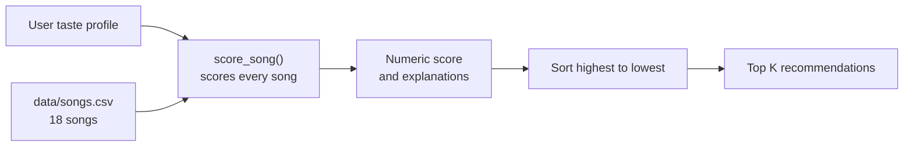

````markdown
# 🎵 Music Recommender Simulation

## Project Summary

VibeMatch 1.0 is a transparent, content-based music recommendation
system. It compares each song's genre, mood, energy, acousticness,
instrumentalness, and popularity with a user's taste profile.

The system calculates a weighted score for every song, ranks the
catalog from strongest to weakest match, and explains the specific
reasons behind each recommendation.

Unlike large platforms that learn from millions of users, this
simulation focuses on understandable scoring rules and a small
catalog of 18 songs.

---

## How the System Works

Real-world platforms such as Spotify and YouTube use several types of
data to predict what a person may enjoy.

One approach is **collaborative filtering**, which uses the behavior of
many users. For example, if two users listen to many of the same songs,
the system may recommend songs that one user enjoyed to the other user.

Another approach is **content-based filtering**, which compares the
attributes of songs. These attributes may include:

- Genre
- Mood
- Tempo
- Energy
- Danceability
- Acousticness

Large recommendation platforms may also use user behavior such as:

- Likes
- Skips
- Replays
- Search history
- Playlist additions
- Listening duration
- Songs enjoyed by similar users

My project uses **content-based filtering**. It does not have real
listening history or data from other users. Instead, it compares each
song's attributes with an explicit user taste profile.

The recommendation process has three main parts:

1. **Input data:** The song catalog contains attributes such as genre,
   mood, energy, and tempo.
2. **User preferences:** The user profile describes the type of music
   the listener wants.
3. **Scoring and ranking:** Every song receives a numeric score based
   on how closely it matches the user. The songs are then sorted from
   highest to lowest score.

The goal of this project is explainability. Every recommendation
includes the specific reasons it received its score.

---

## Dataset

The catalog contains **18 songs** stored in `data/songs.csv`.

The dataset includes 15 genres:

- Pop
- Lofi
- Rock
- Ambient
- Jazz
- Synthwave
- Indie pop
- Hip-hop
- Classical
- EDM
- Reggae
- Metal
- R&B
- Country
- Folk

Each song contains the following attributes:

- `id` — unique song identifier
- `title` — song title
- `artist` — performer
- `genre` — musical category
- `mood` — the song's overall vibe
- `energy` — intensity from 0.0 to 1.0
- `tempo_bpm` — speed in beats per minute
- `valence` — musical positivity from 0.0 to 1.0
- `danceability` — rhythmic movement from 0.0 to 1.0
- `acousticness` — acoustic sound level from 0.0 to 1.0
- `instrumentalness` — amount of instrumental content from 0.0 to 1.0
- `popularity` — how mainstream the song is from 0.0 to 1.0

The scoring system currently uses:

- Genre
- Mood
- Energy
- Acousticness
- Instrumentalness
- Popularity

Tempo, valence, and danceability are stored in the dataset but are not
currently included in the final score.

---

## User Taste Profile

A user profile can include:

- `genre` or `favorite_genre`
- `mood` or `favorite_mood`
- `energy` or `target_energy`
- `likes_acoustic`
- `likes_instrumental`
- `prefers_popular`

Some preferences are optional. If an optional preference is not
provided, that scoring rule is skipped. The final score is normalized
using only the active rules.

Example profile:

```python
{
    "genre": "pop",
    "mood": "happy",
    "energy": 0.9,
    "likes_acoustic": False,
    "likes_instrumental": False,
    "prefers_popular": True,
}
```

---

## Algorithm Recipe

Each song is scored using six weighted rules.

| Feature | Weight | Scoring method |
|---|---:|---|
| Genre | 0.25 | Full points for an exact match |
| Mood | 0.20 | Full points for an exact match |
| Energy | 0.20 | Points based on closeness to the target |
| Acousticness | 0.15 | Rewards acoustic or electronic preference |
| Instrumentalness | 0.10 | Rewards instrumental or vocal preference |
| Popularity | 0.10 | Rewards mainstream or niche preference |

The final score is normalized to a value between `0.0` and `1.0`.

### Genre and mood

Genre and mood use exact matching.

Example:

```text
User genre: pop
Song genre: pop

Result: The song receives the full genre weight of 0.25.
```

### Energy similarity

Energy is calculated using closeness to the user's target:

```text
closeness = 1 - |song energy - target energy|
```

A song does not receive more points simply because its energy is high.
It receives more points when its energy is close to the value requested
by the user.

Example:

```text
User target energy: 0.80
Song energy: 0.75

Closeness = 1 - |0.75 - 0.80|
Closeness = 0.95
```

The song receives 95% of the available energy points.

### Ranking rule

The recommendation function:

1. Loops through every song in the catalog.
2. Calls `score_song()` for each song.
3. Stores the score and explanation reasons.
4. Sorts the songs from highest to lowest score.
5. Returns the top `k` recommendations.

---

## Data Flow



In simple terms:

```text
User preferences
        +
Song catalog
        ↓
Score every song
        ↓
Sort songs by score
        ↓
Return top recommendations
```

---

## Project Structure

```text
music-recommender-simulation/
│
├── data/
│   └── songs.csv
│
├── src/
│   ├── main.py
│   └── recommender.py
│
├── tests/
│   └── test_recommender.py
│
├── README.md
├── model_card.md
├── ai_interactions.md
└── requirements.txt
```

---

## Getting Started

### 1. Create a virtual environment

```bash
python -m venv .venv
```

Activate it on macOS or Linux:

```bash
source .venv/bin/activate
```

Activate it on Windows:

```bash
.venv\Scripts\activate
```

### 2. Install dependencies

```bash
pip install -r requirements.txt
```

### 3. Run the recommender

```bash
python -m src.main
```

The program loads the songs from the CSV file and prints recommendations
for several different user profiles.

---

## Running Tests

Run the automated tests with:

```bash
pytest
```

The tests verify that:

- Recommendations are sorted correctly.
- The strongest matching song appears first.
- Recommendation explanations return readable text.

Example successful result:

```text
2 passed
```

---

## Sample Recommendation Output

The following output is from the **High-Energy Pop** profile:

```text
Loaded songs: 18

=== High-Energy Pop ===
profile: {
    'genre': 'pop',
    'mood': 'happy',
    'energy': 0.9,
    'likes_acoustic': False,
    'likes_instrumental': False,
    'prefers_popular': True
}

1. Sunrise City — Neon Echo  (score: 0.93)
     • genre match: pop (+0.25)
     • mood match: happy (+0.20)
     • energy close to target (+0.18)
     • produced/electronic match (+0.12)
     • vocal match (+0.10)
     • popular pick (+0.08)

2. Gym Hero — Max Pulse  (score: 0.77)
     • genre match: pop (+0.25)
     • energy close to target (+0.19)
     • produced/electronic match (+0.14)
     • vocal match (+0.10)
     • popular pick (+0.09)

3. Rooftop Lights — Indigo Parade  (score: 0.63)
     • mood match: happy (+0.20)
     • energy close to target (+0.17)
     • produced/electronic match (+0.10)
     • vocal match (+0.09)
     • popular pick (+0.07)
```

These results make sense because `Sunrise City` matches the requested
genre, mood, energy, electronic sound, vocal preference, and popularity
preference.

`Gym Hero` also performs well because it is a popular, high-energy pop
song. However, it does not receive mood points because its mood is
listed as intense instead of happy.

---

## Experiments with Multiple User Profiles

I tested the recommender with five different user profiles:

1. High-Energy Pop
2. Chill Lofi
3. Deep Intense Rock
4. Conflicting high-energy and melancholy preferences
5. Minimal energy-only preferences

### Profile 1: High-Energy Pop

```text
1. Sunrise City — Neon Echo  (score: 0.93)
2. Gym Hero — Max Pulse  (score: 0.77)
3. Rooftop Lights — Indigo Parade  (score: 0.63)
```

This profile prefers energetic, vocal, produced, and popular music.
The top two songs are pop songs, and `Sunrise City` also matches the
happy mood.

### Profile 2: Chill Lofi

```text
1. Library Rain — Paper Lanterns  (score: 0.92)
2. Midnight Coding — LoRoom  (score: 0.87)
3. Focus Flow — LoRoom  (score: 0.69)
```

This profile prefers low-energy, acoustic, instrumental, and niche
music. Its recommendations are very different from the High-Energy Pop
profile because the preferences are almost complete opposites.

### Profile 3: Deep Intense Rock

```text
1. Storm Runner — Voltline  (score: 0.91)
2. Gym Hero — Max Pulse  (score: 0.64)
3. Iron Verdict — Blacksteel Rise  (score: 0.47)
```

`Storm Runner` ranks first because it matches the requested rock genre,
intense mood, high energy, electronic sound, and vocal preference.

`Gym Hero` is a pop song, but it still ranks second because it shares
the high-energy and intense characteristics requested by the user.
This demonstrates that numeric features can connect songs across
different genres.

### Profile comparison

The High-Energy Pop and Chill Lofi profiles produce opposite results.
The pop profile favors loud, produced, vocal, and popular songs. The
lofi profile favors quiet, acoustic, instrumental, and less-popular
songs.

The Pop and Rock profiles share some recommendations because they both
request high-energy music. However, their top results differ because
genre and mood still have strong weights.

---

## Edge Cases

### Conflicting preferences

I tested a profile that requested:

- Classical genre
- Melancholy mood
- Very high energy
- Acoustic sound
- Instrumental music
- Niche popularity

The top result was:

```text
1. Winter Elegy — Aria Solenne  (score: 0.82)
```

This song matches the classical genre and melancholy mood, but its
energy is only `0.30`, far below the user's target of `0.95`.

This revealed a weakness in the algorithm. Genre and mood together are
worth enough points to override a large energy mismatch. The program
does not currently warn the user when preferences conflict.

### Minimal preferences

I also tested a profile containing only:

```python
{"energy": 0.5}
```

The top results were:

```text
1. Velvet Hours — Mara Sky  (score: 0.98)
2. Dust Road Home — Cedar & Pine  (score: 0.98)
3. Island Time — Sun Groove  (score: 0.95)
```

Because energy was the only active rule, the scores were normalized
using only the energy weight. Songs close to `0.5` therefore received
scores close to `1.0`.

---

## Weight Experiment

I changed the scoring weights to test how sensitive the results were.

Original weights:

```text
Genre: 0.25
Energy: 0.20
```

Experimental weights:

```text
Genre: 0.125
Energy: 0.40
```

I doubled the importance of energy and cut the genre weight in half.

The top recommendation did not change for the Pop or Rock profile
because each top song matched both the genre and energy preference.
However, high-energy songs from other genres moved higher in the
rankings.

For example, `Storm Runner` increased from approximately `0.48` to
`0.63` for the Pop profile.

The experiment made the recommendations more energy-driven, but not
automatically more accurate. This showed me that scoring weights are
design choices based on what the developer believes should matter most.

---

## Limitations and Risks

### Small dataset

The catalog only contains 18 songs. Most genres appear only once, so
the system has very few choices for some user profiles.

### Exact genre and mood matching

Genre and mood use all-or-nothing matching. A rock user receives no
genre credit for a metal song even though the genres may be related.

### Filter bubbles

The system recommends songs that are similar to the preferences the
user already entered. It does not intentionally introduce variety or
surprising new genres.

### Popularity bias

If a user prefers popular music, already-mainstream songs receive an
advantage. This could make niche artists less visible.

### Correlated features

Mood and energy can overlap. For example, intense songs are often
high-energy. The model may partially count the same musical quality
twice.

### Missing context

The system does not understand:

- Lyrics
- Language
- Era
- Cultural context
- Personal memories connected to music
- Changes in a person's taste over time

A song may sound happy but contain sad lyrics, and the recommender
would not recognize that difference.

---

## Ideas for Improvement

Future versions could include:

- Soft genre matching for related genres such as rock and metal
- Conflict warnings when user preferences disagree
- More songs from real datasets
- Several user profiles for different situations such as studying,
  exercising, or commuting
- Diversity rules that prevent the top results from being too similar
- Listening history such as likes, skips, and replays
- Feedback that updates a user's profile over time
- Additional scoring features such as valence, tempo, and danceability

---

## Model Card

The complete Model Card includes:

- Intended and non-intended use
- Dataset information
- Algorithm explanation
- Evaluation results
- Biases and limitations
- Future improvements
- Personal reflection

See the full Model Card here:

[View the Model Card](model_card.md)

---

## Reflection

My biggest learning moment was testing the conflicting user profile. I
expected a high-energy song to rank first, but the system selected a
slow classical song because genre and mood had enough combined weight
to overpower the energy preference. This helped me understand that
weights are not automatically correct. They represent decisions made
by the developer about what should matter most.

AI tools helped me understand how to load the CSV, calculate similarity,
sort the recommendations, and create readable explanations. However, I
still needed to verify that numerical values were converted correctly,
that scores stayed between 0 and 1, that the tests passed, and that the
recommendations made sense. The project showed me that a simple
algorithm using points and sorting can still feel intelligent, even
though it is not learning from users like a real machine-learning
system.

---

## AI Usage

I used an AI coding assistant to help with several specific parts of
the project.

### CSV loading

I asked the AI assistant to help implement a CSV loader using Python's
`csv` module. It suggested returning rows as dictionaries and converting
numeric columns before using them in calculations.

I reviewed the output and made sure that fields such as energy,
tempo, valence, danceability, acousticness, instrumentalness, and
popularity were converted to numeric values.

### Scoring and ranking

I gave the assistant my algorithm recipe and asked it to help implement
the scoring and recommendation functions. It helped structure the
weighted rules and explained how `sorted()` and `.sort()` behave.

I verified that the implementation matched my planned weights, that
energy used closeness instead of simply rewarding larger values, and
that results were sorted from highest to lowest score.

### Evaluation

I used AI to brainstorm adversarial user profiles and possible biases.
The conflicting profile helped reveal that genre and mood could override
the energy preference.

I reviewed the outputs myself and connected the failure to the exact
weights and scoring rules instead of accepting the AI explanation
without checking the math.
````
