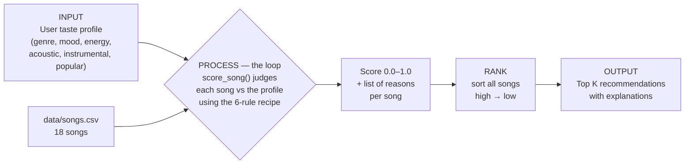

# 🎵 Music Recommender Simulation

## Project Summary

In this project you will build and explain a small music recommender system.

Your goal is to:

- Represent songs and a user "taste profile" as data
- Design a scoring rule that turns that data into recommendations
- Evaluate what your system gets right and wrong
- Reflect on how this mirrors real world AI recommenders

Replace this paragraph with your own summary of what your version does.

---

## How The System Works

Real-world platforms like Spotify and YouTube predict what you'll love next by blending two ideas: **collaborative filtering**, which recommends music based on the behavior of users with similar taste ("people like you also liked this"), and **content-based filtering**, which recommends songs whose measurable attributes — tempo, energy, mood — resemble songs you already enjoy. At full scale they lean heavily on massive behavioral datasets (likes, skips, replays, watch time) fed into machine-learning models. My simulation is a **content-based** recommender: it has no crowd of other users to learn from, so instead of behavior it prioritizes the *attributes of the songs themselves* and how well they match an explicit user taste profile. The system scores every song against the user's preferences using a transparent, weighted rulebook, then ranks those scores to surface the best matches. I deliberately favor **explainability over accuracy** — every recommendation can state, in plain language, exactly why it was chosen — because the goal of this project is to understand how data becomes a prediction, not to compete with a real streaming service.

### Features used

**`Song`** describes each track's attributes (18 songs in `data/songs.csv`):

- `id` — unique identifier
- `title` — song name
- `artist` — performer
- `genre` — category (pop, lofi, rock, …) *(used in scoring)*
- `mood` — vibe label (happy, chill, intense, …) *(used in scoring)*
- `energy` — intensity, 0–1 *(used in scoring)*
- `tempo_bpm` — speed in beats per minute
- `valence` — musical positivity (happy vs sad), 0–1
- `danceability` — rhythmic groove, 0–1
- `acousticness` — organic vs electronic texture, 0–1 *(used in scoring)*
- `instrumentalness` — how vocal-free the track is, 0–1 *(used in scoring)*
- `popularity` — how mainstream the track is, 0–1 *(used in scoring)*

**`UserProfile`** stores the listener's explicit taste:

- `favorite_genre` — the genre they prefer
- `favorite_mood` — the vibe they're after
- `target_energy` — how intense they want it, 0–1
- `likes_acoustic` — whether they prefer acoustic sound (True/False)
- `likes_instrumental` — whether they prefer instrumental music (True/False/None)
- `prefers_popular` — whether they prefer mainstream hits (True/False/None)

### The Algorithm Recipe

The starting point suggested by the module was a simple point system (**+2.0** for a genre match, **+1.0** for a mood match, plus similarity points for energy). I kept that core intuition — **genre is the strongest signal, mood is second, energy is a *closeness* score** — but finalized it as a **weighted recipe normalized to `[0.0, 1.0]`** so scores are easy to read and compare. The weights below preserve the same priority order (genre > mood > energy) as the +2.0 / +1.0 starting point, while adding two more taste dimensions.

Each song earns points from up to six rules; the total is divided by the weight of the rules that applied, giving a final score in **[0.0, 1.0]**:

| Rule | Compares | Weight | How points are earned |
|------|----------|:------:|-----------------------|
| Genre match | `genre` vs `favorite_genre` | **0.25** | full points if exact match, else 0 |
| Mood match | `mood` vs `favorite_mood` | **0.20** | full points if exact match, else 0 |
| Energy fit | `energy` vs `target_energy` | **0.20** | closeness: `(1 − \|energy − target_energy\|) × weight` |
| Acoustic fit | `acousticness` vs `likes_acoustic` | **0.15** | rewards the end of the scale the user prefers |
| Instrumental fit | `instrumentalness` vs `likes_instrumental` | **0.10** | rewards vocal-vs-instrumental preference |
| Popularity fit | `popularity` vs `prefers_popular` | **0.10** | rewards mainstream-vs-niche preference |

**Design choices:**
- **Genre is weighted highest** because it is the most reliable "is this my kind of music?" signal; mood is second but coarser and partly overlaps with energy.
- **Numeric features are scored by *closeness*, not magnitude** — a song near the user's target energy scores well whether it's slightly above *or* below, using `1 − |song − target|`.
- **Additive, not filtering** — a song that misses on genre still competes on the other rules, so the ranking degrades gracefully on a small catalog.
- **Optional preferences** (`likes_instrumental`, `prefers_popular`) can be left unset (`None`); their rule is simply skipped and the score renormalizes.

### Data Flow

A single song travels from the CSV to the ranked list like this:



In words: **Input** (user prefs) → **Process** (loop over every song, applying the scoring recipe) → **Output** (sort by score, return the top *k* with plain-language reasons).

### Potential biases I expect

- **Genre over-prioritization.** With genre at the highest weight *and* as an all-or-nothing match, the system may bury a song that perfectly matches the user's mood and energy just because its genre label differs (e.g. `metal` scores 0 on genre for a `rock` fan even though they are close cousins). Great cross-genre matches get ignored.
- **Popularity bias.** The `prefers_popular` rule can push already-mainstream songs up the ranking — the same rich-get-richer dynamic that affects real recommenders, which tends to hide niche artists.
- **Redundancy inflation.** `mood` and `energy` are correlated (intense songs are usually high-energy), so the system partly double-counts intensity and under-weights other traits.
- **Blindness to lyrics and culture.** The recipe only sees numeric/label features — it cannot tell a bright-sounding song with devastating lyrics from a genuinely happy one, and has no sense of era or cultural context.
- **Tiny, synthetic catalog.** With only 18 hand-authored songs, the results reflect my feature choices more than any real listening data.

---

## Getting Started

### Setup

1. Create a virtual environment (optional but recommended):

   ```bash
   python -m venv .venv
   source .venv/bin/activate      # Mac or Linux
   .venv\Scripts\activate         # Windows

2. Install dependencies

```bash
pip install -r requirements.txt
```

3. Run the app:

```bash
python -m src.main
```

### Running Tests

Run the starter tests with:

```bash
pytest
```

You can add more tests in `tests/test_recommender.py`.

---

## Sample Recommendation Output

Paste a sample of your recommender's output here as a text block so a reader can see what it produces:

```
# e.g.:
# User profile: genre=indie, mood=chill, energy=low
# Recommendations:
#   1. ...
#   2. ...
#   3. ...
```

**Screenshot or video** *(optional)*: <!-- Insert a screenshot or demo video link here -->

---

## Experiments You Tried

Use this section to document the experiments you ran. For example:

- What happened when you changed the weight on genre from 2.0 to 0.5
- What happened when you added tempo or valence to the score
- How did your system behave for different types of users

---

## Limitations and Risks

Summarize some limitations of your recommender.

Examples:

- It only works on a tiny catalog
- It does not understand lyrics or language
- It might over favor one genre or mood

You will go deeper on this in your model card.

---

## Reflection

Read and complete `model_card.md`:

[**Model Card**](model_card.md)

Write 1 to 2 paragraphs here about what you learned:

- about how recommenders turn data into predictions
- about where bias or unfairness could show up in systems like this


